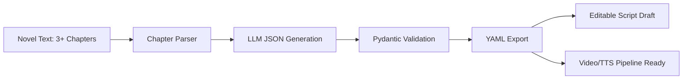

<p align="center">
  
</p>


# ReelForge YAML

**网文转竖屏短剧的结构化改编工作台。**  
把 3 章以上小说自动转换为可编辑、可校验、可追溯的镜头级 YAML 剧本初稿，并为后续 AI 视频、TTS、音效和自动剪辑流水线预留接口。

> 专为可信的AI短剧制作而打造剧本

## Competition Brief & Product Interpretation

本项目对应赛事题目三：**AI 小说转剧本工具**。

> 很多小说作者希望将自己的作品改编成剧本，请开发一款 AI 辅助剧本创作工具，降低改编门槛，提升效率。要求：能将 3 个章节以上的小说文本自动转换为结构化剧本（YAML 格式），让作者可以快速获得可编辑、可进一步打磨的剧本初稿。请额外写一篇文档，定义剧本的 YAML Schema。文档中需说明该 Schema 的设计原因。

我对题目的产品理解是：它不只是“让大模型续写一个剧本”，而是要把小说作者从高门槛、低确定性的改编流程里解放出来，让他们先拿到一份**结构正确、可追溯、可编辑、可评测**的剧本初稿。
定义文档https://github.com/wangzichang224-design/ReelForge-YAML/blob/main/docs/YAML_SCHEMA.md
b站视频介绍
小红书链接https://www.xiaohongshu.com/user/profile/6893b1c60000000028035e28

### User Pain Points

| 用户痛点 | 传统做法的问题 | ReelForge YAML 的解决方式 |
| --- | --- | --- |
| 小说到剧本的格式门槛高 | 作者熟悉叙事文本，但不熟悉分集、分镜、台词、音效和镜头语言 | 自动把 3 章以上小说拆成 `episodes` 和 `shots`，输出 YAML 初稿 |
| AI 容易编造剧情 | 生成结果看起来顺，但作者很难判断镜头来自哪段原文 | 每个镜头保留 `source_ref`，全局保留 `source_map` |
| 初稿难以继续生产 | 普通剧本文字不能直接接视频、TTS、音效或剪辑工具 | 拆分 `visual_track` 和 `audio_track`，预留 AI 视频流水线接口 |
| 角色和画面容易漂移 | 多章节生成时角色外观、服装、场景风格不稳定 | 增加 `visual_bible` 全局视觉黑板，固定角色和资产 |
| “能生成”不等于“好改编” | 结构通过但开场、反转、结尾可能平淡 | 增加硬指标评测和 Critic 纠偏，暴露 badcase 并局部修复 |

### Requirement Mapping

| 赛事要求 | 项目实现 |
| --- | --- |
| 支持 3 个章节以上小说文本 | `chapter_parser.py` 自动识别中文章回和 `Chapter` 标题，不足 3 章会报错 |
| 自动转换为结构化剧本 | `pipeline.py` 完成章节解析、LLM JSON 生成、Pydantic 校验和 YAML 导出 |
| YAML 格式 | `yaml_io.py` 将校验后的结构化对象导出为可编辑 YAML |
| 作者可快速获得可打磨初稿 | Streamlit UI 提供输入、生成、预览、编辑、校验、导出 |
| 定义 YAML Schema | [docs/YAML_SCHEMA.md](docs/YAML_SCHEMA.md) 说明字段、结构和设计原因 |
| 降低改编门槛、提升效率 | 自动完成初稿结构化、镜头拆解、台词/音画分离、来源映射和质量评测 |

### Why Expand To Vertical Short Drama

题目要求是“小说转剧本”，我将场景进一步收敛到**网文转竖屏短剧**，原因是这个方向更贴近当前小说作者的真实商业化路径：

- 网文作者最常见的改编需求不是传统长剧，而是节奏更快、反馈更快的短剧初稿。
- 竖屏短剧对结构化要求更强：开场 3 秒、每集反转、结尾钩子、镜头级画面都必须明确。
- 短剧生产链路天然需要结构化数据：后续可以继续接角色图、AI 视频、TTS、音效、剪辑和质量评估。
- 这让项目从“演示大模型会写剧本”升级为“面向内容生产工作流的 AI 辅助创作产品”。

因此 ReelForge YAML 的核心定位是：**可信任的人机协同剧本初稿生成器**。它不追求三天内全自动生成成片，而是先把最有价值、最可交付的一步做好：把小说变成作者能编辑、系统能校验、后续流水线能使用的镜头级 YAML。

## Why ReelForge

很多小说作者想把网文改成短剧，但真正难点不只是“写成剧本”，而是把长文本压缩成能被短剧生产链路使用的结构：

- 每集开场 3 秒要有强冲突。
- 心理描写要转成可见动作、表情、站位和声音。
- 镜头要能继续喂给 Kling、Runway、可灵、即梦等视频模型。
- 台词、音效、TTS 情绪和画面提示词不能混在一起。
- 作者需要知道每个镜头来自哪段原文，避免 AI 编造剧情。

ReelForge YAML 的目标是先把“小说 → 短剧分集 → 镜头级分镜 → AI 视频友好提示词”这一步做稳。

## Highlights

- **3+ chapter adaptation**: 自动识别 `第一章`、`第1章`、`Chapter 1` 等章节标题。
- **Short-drama rhythm**: 每章默认改编为 1 集，每集 10-15 个镜头，首镜头强 hook，尾镜头 cliffhanger。
- **Schema-first output**: 模型先输出 JSON，经 Pydantic 校验后再导出 YAML。
- **Source Map provenance**: 每集/每镜头绑定原文片段，方便作者回改和验真。
- **Video-ready prompts**: 每个镜头包含英文 `video_prompt`，适配主流图生视频/文生视频模型。
- **Quality evaluation loop**: 用硬指标评测黄金三秒、结尾钩子、权力翻转、视觉可执行性、角色连续性和来源可追溯性。
- **Human-in-the-loop editor**: Streamlit UI 支持 YAML 编辑、重新校验和导出。
- **DeepSeek/OpenAI-compatible**: 支持 DeepSeek 或其他国产兼容 API；没有 API key 也可用离线 demo 生成器演示。

## Demo Flow



## YAML Shape

```yaml
series_metadata:
  title: "隐婚风暴"
  target_format: "vertical_short_drama"
  aspect_ratio: "9:16"
characters: []
episodes:
  - episode_number: 1
    hook_summary: "开场三秒制造当众压迫"
    emotional_curve: ["受辱", "隐忍", "逼问", "反转", "悬念"]
    cliffhanger: "关键证据即将曝光"
    shots:
      - shot_id: "ep01_s01"
        purpose: "opening_hook"
        visual_track:
          framing: "close_up"
          camera_movement: "fast push-in"
          video_prompt: "A tense vertical short drama opening..."
        audio_track:
          dialogue: []
          sfx: []
        source_ref: {}
source_map: []
```

Full design notes are in [docs/YAML_SCHEMA.md](docs/YAML_SCHEMA.md).

## Quick Start

```powershell
cd D:\03_AI_Projects\shortdrama-yaml-studio
python -m streamlit run app.py
```

Open the local Streamlit URL and keep **使用离线 Demo 生成器** checked for a no-key demo. To use DeepSeek or another OpenAI-compatible API, uncheck it and provide:

- `API Key`
- `Base URL`, for example `https://api.deepseek.com`
- `Model`, for example `deepseek-chat`

## Demo Video

赛事要求 demo 视频需包含声音讲解、核心功能展示和可访问外链。当前 README 先保留提交位，最终提交前请替换为实际视频链接：

- Demo video: `TODO: paste bilibili / cloud drive link before final submission`

建议视频结构：

1. 说明题目要求和用户痛点：小说作者需要低门槛获得可编辑剧本初稿。
2. 展示输入 3 章小说文本，自动拆章。
3. 展示生成 YAML：`series_metadata`、`characters`、`episodes`、`shots`、`source_map`。
4. 展示“测评与优化”区：badcase、分项分、cliffhanger 备选、局部修改。
5. 展示导出 YAML 和 Schema 文档。

可直接照读的录屏脚本见 [docs/DEMO_VIDEO_SCRIPT.md](docs/DEMO_VIDEO_SCRIPT.md)。

## Contest Submission Notes

为了匹配赛事提交要求，本仓库采用以下交付规范：

- **Repository visibility**: 开发过程可保持私有以防抄袭；提交截止后需公开 GitHub/Gitee 仓库，供评委访问。
- **PR-first workflow**: 后续所有新功能、文档补充和修复都应通过独立分支 + Pull Request 合并，不再直接提交到 `main`。
- **Small PRs**: 每个 PR 只做一件事，例如“补 Schema 文档”“新增评测模块”“更新 demo 视频链接”。
- **PR description**: 使用 `.github/pull_request_template.md`，必须填写功能描述、实现思路、测试方式和原创/依赖说明。
- **Runnable main**: PR 合并前必须通过 `python -m pytest`，保证评委任意时间拉取 `main` 都能复现 demo。
- **Commit timing**: 后续 commit 和 PR 时间应落在赛事所选批次的起止时间内；不要在最后一天一次性导入全部代码。

提交前清单见 [docs/SUBMISSION_CHECKLIST.md](docs/SUBMISSION_CHECKLIST.md)。
后续小步 PR 计划见 [docs/PR_DELIVERY_PLAN.md](docs/PR_DELIVERY_PLAN.md)。

## Dependencies & Original Work

Third-party dependencies are intentionally lightweight and listed in [requirements.txt](requirements.txt):

| Dependency | Purpose |
| --- | --- |
| `streamlit` | Product demo UI |
| `pydantic` | Strict schema validation |
| `PyYAML` | YAML export/import |
| `openai` | OpenAI-compatible client for DeepSeek or similar models |
| `pytest` | Regression tests |

Original implementation in this repository includes:

- Novel chapter parsing and minimum 3-chapter validation.
- Pydantic YAML Schema for vertical short-drama scripts.
- JSON-first generation pipeline with YAML export.
- Source provenance through `source_ref` and `source_map`.
- Rule-based quality evaluator and badcase reporting.
- Global visual scratchpad / `visual_bible` injection.
- Critic-generator local optimization loop.
- Streamlit human-in-the-loop editing and evaluation interface.

Referenced open-source projects are listed in [References](#references). They are used as product and architecture references only; this repository implements its own schema, pipeline, evaluator, UI and tests.

## DeepSeek Evaluation Sample

This repo includes a golden dataset, a generated evaluation novel and a real DeepSeek output:

- Golden dataset targets: [samples/golden_dataset.yaml](samples/golden_dataset.yaml)
- Input novel: [samples/eval_novel_shadow_contract_3ch.txt](samples/eval_novel_shadow_contract_3ch.txt)
- Quiet transition test: [samples/eval_novel_quiet_transition_3ch.txt](samples/eval_novel_quiet_transition_3ch.txt)
- Palace intrigue test: [samples/eval_novel_palace_lantern_3ch.txt](samples/eval_novel_palace_lantern_3ch.txt)
- Hospital inheritance test: [samples/eval_novel_hospital_will_3ch.txt](samples/eval_novel_hospital_will_3ch.txt)
- Midnight refund test: [samples/eval_novel_midnight_refund_3ch.txt](samples/eval_novel_midnight_refund_3ch.txt)
- Raw DeepSeek output: [samples/deepseek_shadow_contract_3ch_output.yaml](samples/deepseek_shadow_contract_3ch_output.yaml)
- Optimized output: [samples/deepseek_shadow_contract_3ch_optimized.yaml](samples/deepseek_shadow_contract_3ch_optimized.yaml)

Run the same evaluation locally:

```powershell
$env:DEEPSEEK_API_KEY="your-api-key"
python scripts\run_deepseek_generation.py `
  --input samples\eval_novel_shadow_contract_3ch.txt `
  --output samples\deepseek_shadow_contract_3ch_output.yaml `
  --model deepseek-chat `
  --shots 10
```

Then run the hard-metric evaluator:

```powershell
python scripts\evaluate_yaml.py --input samples\deepseek_shadow_contract_3ch_output.yaml
python scripts\evaluate_yaml.py `
  --input samples\deepseek_shadow_contract_3ch_output.yaml `
  --scratchpad `
  --optimize `
  --output samples\deepseek_shadow_contract_3ch_optimized.yaml
```

The raw DeepSeek sample already passes the structural schema:

- 3 input chapters
- 3 generated episodes
- 30 total shots

But the evaluator catches the key badcase: all 3 episodes label the first shot as `opening_hook`, while the actual picture still starts with atmosphere or setup. Raw scores:

- overall_score = 0.811
- badcases = 14
- episode hook_score = 0.20 / 0.40 / 0.55

After enabling the global scratchpad and local critic rewrite:

- overall_score = 0.95
- episodes = 3
- shots = 30
- remaining badcases = 3 provenance notes for shots explicitly marked as adapted from context
- each episode passes hook, cliffhanger, power shift, visual executability and continuity thresholds

Design notes for this loop are in [docs/EVALUATION.md](docs/EVALUATION.md).

## Golden Benchmark

Run the full offline benchmark across all registered golden samples:

```powershell
python scripts\run_golden_benchmark.py
```

Checked-in benchmark report:

- Markdown: [reports/golden_benchmark.md](reports/golden_benchmark.md)
- JSON: [reports/golden_benchmark.json](reports/golden_benchmark.json)

Current offline baseline:

- samples = 5
- raw_average_score = 0.905
- optimized_average_score = 0.944
- raw_badcases = 75
- optimized_badcases = 0
- badcase_reduction_rate = 1.0

### Iteration Evidence

This benchmark is the main proof that ReelForge is not only a schema validator:

1. **Golden dataset expansion**: the benchmark now covers urban business, quiet office transition, palace intrigue, hospital inheritance and customer-service suspense.
2. **Measured badcases**: raw offline output still exposes 75 hard-rule badcases, mainly weak visual executability.
3. **Targeted repair**: enabling the visual scratchpad and critic rewrite loop reduces optimized hard-rule badcases to 0 across 5 samples.
4. **Product implication**: authors get an editable YAML draft, while the tool keeps measurable guardrails for hook, cliffhanger, power shift, visual execution, continuity, dialogue language and provenance.

## Test

```powershell
cd D:\03_AI_Projects\shortdrama-yaml-studio
python -m pytest
```

Current regression checks cover:

- Rejecting inputs with fewer than 3 chapters.
- Generating YAML that can be loaded back by `yaml.safe_load`.
- Enforcing 10-15 shots per episode.
- Enforcing `opening_hook` as the first shot and `cliffhanger` as the last shot.
- Requiring English video prompts.
- Preserving source references through `source_map`.
- Detecting fake opening hooks, weak cliffhangers, missing power shifts, abstract video prompts and character drift.
- Verifying the local critic loop repairs the checked-in DeepSeek badcase without changing episode or shot count.

## Project Structure

```text
app.py                                      Streamlit product UI
assets/logo.svg                            Project logo
assets/banner.svg                          README banner
src/shortdrama_yaml/schema.py              Pydantic script schema
src/shortdrama_yaml/chapter_parser.py      Chapter boundary parser
src/shortdrama_yaml/pipeline.py            Parse → generate → validate → export
src/shortdrama_yaml/llm_client.py          DeepSeek/OpenAI-compatible JSON mode
src/shortdrama_yaml/offline_generator.py   No-key demo generator
src/shortdrama_yaml/evaluator.py           Rule-based quality metrics
src/shortdrama_yaml/critic.py              Expert critic agent wrapper
src/shortdrama_yaml/scratchpad.py          Global visual bible extraction/injection
src/shortdrama_yaml/iteration.py           Critic-generator local rewrite loop
scripts/run_deepseek_generation.py         Real API evaluation runner
scripts/evaluate_yaml.py                   YAML quality evaluator and optimizer
docs/YAML_SCHEMA.md                        Schema design rationale
docs/EVALUATION.md                         Badcase evaluation rationale
samples/sample_novel_three_chapters.txt    Demo input
tests/                                     Regression tests
```

## Design Principles

- **Trusted assistance over full automation**: the output is a strong editable first draft, not an unreviewed final script.
- **JSON first, YAML second**: JSON is easier to validate; YAML is easier for authors to edit.
- **Audio/visual separation**: `visual_track` serves image/video models; `audio_track` serves TTS, SFX and editing.
- **Provenance by default**: `source_ref` and `source_map` reduce hallucination risk and support human review.
- **Evaluate before celebrating**: schema validity only proves the YAML shape is correct; hard metrics prove whether it behaves like vertical short drama.
- **Extensible pipeline**: the schema is ready for future modules such as role reference images, shot video generation, TTS and MoviePy/FFmpeg assembly.

## References

- [NovelVids](https://github.com/Anning01/novelvids): novel-to-short-drama production workflow.
- [Huobao Drama](https://github.com/chatfire-AI/huobao-drama): AI short drama generation agents.
- [Jellyfish](https://github.com/Forget-C/Jellyfish): script understanding, shot preparation and asset consistency.
- [Open-AI-Micro-Drama-Generator](https://github.com/Anil-matcha/Open-AI-Micro-Drama-Generator): multi-agent script-to-video flow.
- [SkyScript-100M](https://github.com/vaew/SkyScript-100M): short-drama script and shooting-script dataset reference.
- [Dramatron](https://github.com/google-deepmind/dramatron): hierarchical AI screenplay generation.

## License

MIT. See [LICENSE](LICENSE).
