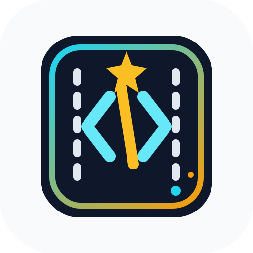
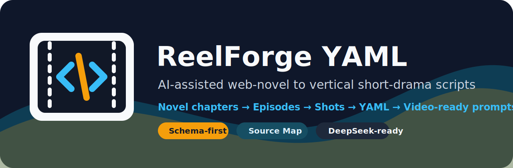
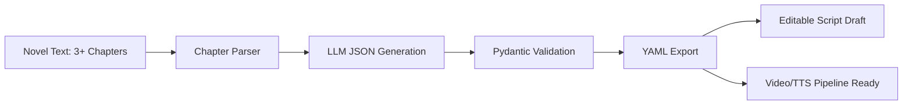

<p align="center">
  
</p>



# ReelForge YAML

**网文转竖屏短剧的结构化改编工作台。**  
把 3 章以上小说自动转换为可编辑、可校验、可追溯的镜头级 YAML 剧本初稿，并为后续 AI 视频、TTS、音效和自动剪辑流水线预留接口。

> Schema-first AI-assisted adaptation, built for trusted human-in-the-loop short-drama production.

## Why ReelForge

很多小说作者想把网文改成短剧，但真正难点不只是“写成剧本”，而是把长文本压缩成能被短剧生产链路使用的结构：

- 每集开场 3 秒要有强冲突。
- 心理描写要转成可见动作、表情、站位和声音。
- 镜头要能继续喂给 Kling、Runway、可灵、即梦等视频模型。
- 台词、音效、TTS 情绪和画面提示词不能混在一起。
- 作者需要知道每个镜头来自哪段原文，避免 AI 编造剧情。

ReelForge YAML 的目标是先把“小说 → 短剧分集 → 镜头级分镜 → AI 视频友好提示词”这一步做稳。

## Highlights

- **3+ chapter adaptation**: 自动识别 `第一章`、`第1章`、`Chapter 1` 等章节标题。
- **Short-drama rhythm**: 每章默认改编为 1 集，每集 10-15 个镜头，首镜头强 hook，尾镜头 cliffhanger。
- **Schema-first output**: 模型先输出 JSON，经 Pydantic 校验后再导出 YAML。
- **Source Map provenance**: 每集/每镜头绑定原文片段，方便作者回改和验真。
- **Video-ready prompts**: 每个镜头包含英文 `video_prompt`，适配主流图生视频/文生视频模型。
- **Human-in-the-loop editor**: Streamlit UI 支持 YAML 编辑、重新校验和导出。
- **DeepSeek/OpenAI-compatible**: 支持 DeepSeek 或其他国产兼容 API；没有 API key 也可用离线 demo 生成器演示。

## Demo Flow



## YAML Shape

```yaml
series_metadata:
  title: "隐婚风暴"
  target_format: "vertical_short_drama"
  aspect_ratio: "9:16"
characters: []
episodes:
  - episode_number: 1
    hook_summary: "开场三秒制造当众压迫"
    emotional_curve: ["受辱", "隐忍", "逼问", "反转", "悬念"]
    cliffhanger: "关键证据即将曝光"
    shots:
      - shot_id: "ep01_s01"
        purpose: "opening_hook"
        visual_track:
          framing: "close_up"
          camera_movement: "fast push-in"
          video_prompt: "A tense vertical short drama opening..."
        audio_track:
          dialogue: []
          sfx: []
        source_ref: {}
source_map: []
```

Full design notes are in [docs/YAML_SCHEMA.md](docs/YAML_SCHEMA.md).

## Quick Start

```powershell
cd D:\03_AI_Projects\shortdrama-yaml-studio
python -m streamlit run app.py
```

Open the local Streamlit URL and keep **使用离线 Demo 生成器** checked for a no-key demo. To use DeepSeek or another OpenAI-compatible API, uncheck it and provide:

- `API Key`
- `Base URL`, for example `https://api.deepseek.com`
- `Model`, for example `deepseek-chat`

## DeepSeek Evaluation Sample

This repo includes a generated evaluation novel and a real DeepSeek output:

- Input novel: [samples/eval_novel_shadow_contract_3ch.txt](samples/eval_novel_shadow_contract_3ch.txt)
- DeepSeek output: [samples/deepseek_shadow_contract_3ch_output.yaml](samples/deepseek_shadow_contract_3ch_output.yaml)

Run the same evaluation locally:

```powershell
$env:DEEPSEEK_API_KEY="your-api-key"
python scripts\run_deepseek_generation.py `
  --input samples\eval_novel_shadow_contract_3ch.txt `
  --output samples\deepseek_shadow_contract_3ch_output.yaml `
  --model deepseek-chat `
  --shots 10
```

The checked-in DeepSeek sample passes the project schema with:

- 3 input chapters
- 3 generated episodes
- 30 total shots
- 0 quality warnings

## Test

```powershell
cd D:\03_AI_Projects\shortdrama-yaml-studio
python -m pytest
```

Current regression checks cover:

- Rejecting inputs with fewer than 3 chapters.
- Generating YAML that can be loaded back by `yaml.safe_load`.
- Enforcing 10-15 shots per episode.
- Enforcing `opening_hook` as the first shot and `cliffhanger` as the last shot.
- Requiring English video prompts.
- Preserving source references through `source_map`.

## Project Structure

```text
app.py                                      Streamlit product UI
assets/logo.svg                            Project logo
assets/banner.svg                          README banner
src/shortdrama_yaml/schema.py              Pydantic script schema
src/shortdrama_yaml/chapter_parser.py      Chapter boundary parser
src/shortdrama_yaml/pipeline.py            Parse → generate → validate → export
src/shortdrama_yaml/llm_client.py          DeepSeek/OpenAI-compatible JSON mode
src/shortdrama_yaml/offline_generator.py   No-key demo generator
scripts/run_deepseek_generation.py         Real API evaluation runner
docs/YAML_SCHEMA.md                        Schema design rationale
samples/sample_novel_three_chapters.txt    Demo input
tests/                                     Regression tests
```

## Design Principles

- **Trusted assistance over full automation**: the output is a strong editable first draft, not an unreviewed final script.
- **JSON first, YAML second**: JSON is easier to validate; YAML is easier for authors to edit.
- **Audio/visual separation**: `visual_track` serves image/video models; `audio_track` serves TTS, SFX and editing.
- **Provenance by default**: `source_ref` and `source_map` reduce hallucination risk and support human review.
- **Extensible pipeline**: the schema is ready for future modules such as role reference images, shot video generation, TTS and MoviePy/FFmpeg assembly.

## References

- [NovelVids](https://github.com/Anning01/novelvids): novel-to-short-drama production workflow.
- [Huobao Drama](https://github.com/chatfire-AI/huobao-drama): AI short drama generation agents.
- [Jellyfish](https://github.com/Forget-C/Jellyfish): script understanding, shot preparation and asset consistency.
- [Open-AI-Micro-Drama-Generator](https://github.com/Anil-matcha/Open-AI-Micro-Drama-Generator): multi-agent script-to-video flow.
- [SkyScript-100M](https://github.com/vaew/SkyScript-100M): short-drama script and shooting-script dataset reference.
- [Dramatron](https://github.com/google-deepmind/dramatron): hierarchical AI screenplay generation.

## License

MIT. See [LICENSE](LICENSE).
