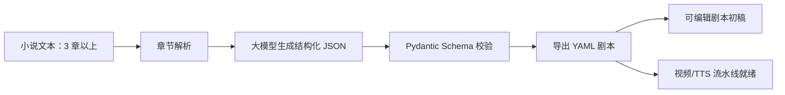

<p align="center">
  
</p>


# ReelForge YAML

**网文转竖屏短剧的结构化改编工作台。**  
把 3 章以上小说自动转换为可编辑、可校验、可追溯的镜头级 YAML 剧本初稿，并为后续 AI 视频、TTS、音效和自动剪辑流水线预留接口。

> 专为可信 AI 短剧制作而打造的结构化剧本工具：以 Schema 为中心，面向可编辑、可追溯的人机协同生产。

## 提交入口

- **在线试用（Streamlit）**：[打开 ReelForge YAML 在线 Demo]([https://reelforge-yaml.streamlit.app](https://reelforge-yaml.streamlit.app/))
- **YAML Schema 文档**：[docs/YAML_SCHEMA.md](docs/YAML_SCHEMA.md)
- **B 站演示视频**：`TODO：录制完成后粘贴 B 站视频链接`
- **小红书项目发布位**：[王子畅的小红书主页](https://www.xiaohongshu.com/user/profile/6893b1c60000000028035e28)（发布单篇项目笔记后可替换为笔记链接）
- **可照读演示稿**：[docs/DEMO_VIDEO_SCRIPT.md](docs/DEMO_VIDEO_SCRIPT.md)

## 赛事题目与产品理解

本项目对应赛事题目三：**AI 小说转剧本工具**。

> 很多小说作者希望将自己的作品改编成剧本，请开发一款 AI 辅助剧本创作工具，降低改编门槛，提升效率。要求：能将 3 个章节以上的小说文本自动转换为结构化剧本（YAML 格式），让作者可以快速获得可编辑、可进一步打磨的剧本初稿。请额外写一篇文档，定义剧本的 YAML Schema。文档中需说明该 Schema 的设计原因。

我对题目的产品理解是：它不只是“让大模型续写一个剧本”，而是要把小说作者从高门槛、低确定性的改编流程里解放出来，让他们先拿到一份**结构正确、可追溯、可编辑、可评测**的剧本初稿。

### 用户痛点

| 用户痛点 | 传统做法的问题 | ReelForge YAML 的解决方式 |
| --- | --- | --- |
| 小说到剧本的格式门槛高 | 作者熟悉叙事文本，但不熟悉分集、分镜、台词、音效和镜头语言 | 自动把 3 章以上小说拆成 `episodes` 和 `shots`，输出 YAML 初稿 |
| AI 容易编造剧情 | 生成结果看起来顺，但作者很难判断镜头来自哪段原文 | 每个镜头保留 `source_ref`，全局保留 `source_map` |
| 初稿难以继续生产 | 普通剧本文字不能直接接视频、TTS、音效或剪辑工具 | 拆分 `visual_track` 和 `audio_track`，预留 AI 视频流水线接口 |
| 角色和画面容易漂移 | 多章节生成时角色外观、服装、场景风格不稳定 | 增加 `visual_bible` 全局视觉黑板，固定角色和资产 |
| “能生成”不等于“好改编” | 结构通过但开场、反转、结尾可能平淡 | 增加硬指标评测和 Critic 纠偏，暴露 badcase 并局部修复 |

### 需求映射

| 赛事要求 | 项目实现 |
| --- | --- |
| 支持 3 个章节以上小说文本 | `chapter_parser.py` 自动识别中文章回和 `Chapter` 标题，不足 3 章会报错 |
| 自动转换为结构化剧本 | `pipeline.py` 完成章节解析、LLM JSON 生成、Pydantic 校验和 YAML 导出 |
| YAML 格式 | `yaml_io.py` 将校验后的结构化对象导出为可编辑 YAML |
| 作者可快速获得可打磨初稿 | Streamlit UI 提供输入、生成、预览、编辑、校验、导出 |
| 定义 YAML Schema | [docs/YAML_SCHEMA.md](docs/YAML_SCHEMA.md) 说明字段、结构和设计原因 |
| 降低改编门槛、提升效率 | 自动完成初稿结构化、镜头拆解、台词/音画分离、来源映射和质量评测 |

### 为什么收敛到竖屏短剧

题目要求是“小说转剧本”，我将场景进一步收敛到**网文转竖屏短剧**，原因是这个方向更贴近当前小说作者的真实商业化路径：

- 网文作者最常见的改编需求不是传统长剧，而是节奏更快、反馈更快的短剧初稿。
- 竖屏短剧对结构化要求更强：开场 3 秒、每集反转、结尾钩子、镜头级画面都必须明确。
- 短剧生产链路天然需要结构化数据：后续可以继续接角色图、AI 视频、TTS、音效、剪辑和质量评估。
- 这让项目从“演示大模型会写剧本”升级为“面向内容生产工作流的 AI 辅助创作产品”。

因此 ReelForge YAML 的核心定位是：**可信任的人机协同剧本初稿生成器**。它不追求三天内全自动生成成片，而是先把最有价值、最可交付的一步做好：把小说变成作者能编辑、系统能校验、后续流水线能使用的镜头级 YAML。

## 为什么做 ReelForge

很多小说作者想把网文改成短剧，但真正难点不只是“写成剧本”，而是把长文本压缩成能被短剧生产链路使用的结构：

- 每集开场 3 秒要有强冲突。
- 心理描写要转成可见动作、表情、站位和声音。
- 镜头要能继续喂给 Kling、Runway、可灵、即梦等视频模型。
- 台词、音效、TTS 情绪和画面提示词不能混在一起。
- 作者需要知道每个镜头来自哪段原文，避免 AI 编造剧情。

ReelForge YAML 的目标是先把“小说 → 短剧分集 → 镜头级分镜 → AI 视频友好提示词”这一步做稳。

## 功能亮点

- **3 章以上小说改编**：自动识别 `第一章`、`第1章`、`Chapter 1` 等章节标题。
- **短剧节奏约束**：每章默认改编为 1 集，每集 10-15 个镜头，首镜头强 hook，尾镜头 cliffhanger。
- **Schema 优先输出**：模型先输出 JSON，经 Pydantic 校验后再导出 YAML。
- **来源追溯**：每集/每镜头绑定原文片段，方便作者回改和验真。
- **视频生产就绪提示词**：每个镜头包含 `video_prompt`，便于后续接入图生视频/文生视频模型。
- **质量评测闭环**：用硬指标评测黄金三秒、结尾钩子、权力翻转、视觉可执行性、角色连续性和来源可追溯性。
- **人机协同编辑器**：Streamlit UI 支持 YAML 编辑、重新校验和导出。
- **国产模型兼容**：支持 DeepSeek 或其他 OpenAI-compatible API；没有 API key 也可用离线 demo 生成器演示。

## 演示流程



## YAML 结构示例

```yaml
series_metadata:
  title: "隐婚风暴"
  target_format: "vertical_short_drama"
  aspect_ratio: "9:16"
characters: []
episodes:
  - episode_number: 1
    hook_summary: "开场三秒制造当众压迫"
    emotional_curve: ["受辱", "隐忍", "逼问", "反转", "悬念"]
    cliffhanger: "关键证据即将曝光"
    shots:
      - shot_id: "ep01_s01"
        purpose: "opening_hook"
        visual_track:
          framing: "close_up"
          camera_movement: "fast push-in"
          video_prompt: "A tense vertical short drama opening..."
        audio_track:
          dialogue: []
          sfx: []
        source_ref: {}
source_map: []
```

完整字段定义和设计原因见 [docs/YAML_SCHEMA.md](docs/YAML_SCHEMA.md)。

## 快速启动

```powershell
cd D:\03_AI_Projects\ReelForge-YAML
python -m streamlit run app.py
```

打开本地 Streamlit URL，勾选 **使用离线 Demo 生成器** 即可无密钥演示。如需使用 DeepSeek 或其他 OpenAI-compatible API，取消勾选后填写：

- `API Key`
- `Base URL`，例如 `https://api.deepseek.com`
- `Model`，例如 `deepseek-chat`

## 视频生产就绪展示

ReelForge 演示不需要付费视频生成 API。Streamlit 应用内置 **项目展示 / 视频预览** 标签页，可以把已生成的 YAML 转成 9:16 分镜预览：

- 镜头时间线
- 手机样式竖屏预览
- 台词字幕
- 原文来源片段
- AI 视频友好提示词
- 求职/答辩讲解稿

这个展示模式用于低成本证明 YAML 已经具备后续接入视频、TTS 和剪辑流水线的数据结构；比赛主线仍然是稳定生成可编辑的剧本初稿。

## 演示视频

赛事要求 demo 视频需包含声音讲解、核心功能展示和可访问外链。当前 README 先保留提交位，最终提交前请替换为实际视频链接：

- B 站演示视频：`TODO：录制完成后粘贴 B 站视频链接`
- 小红书项目发布位：[王子畅的小红书主页](https://www.xiaohongshu.com/user/profile/6893b1c60000000028035e28)（发布单篇项目笔记后可替换为笔记链接）

建议视频结构：

1. 说明题目要求和用户痛点：小说作者需要低门槛获得可编辑剧本初稿。
2. 展示输入 3 章小说文本，自动拆章。
3. 展示生成 YAML：`series_metadata`、`characters`、`episodes`、`shots`、`source_map`。
4. 展示“测评与优化”区：badcase、分项分、cliffhanger 备选、局部修改。
5. 展示导出 YAML 和 Schema 文档。

可直接照读的录屏脚本见 [docs/DEMO_VIDEO_SCRIPT.md](docs/DEMO_VIDEO_SCRIPT.md)。

## 赛事提交说明

为了匹配赛事提交要求，本仓库采用以下交付规范：

- **仓库可见性**：开发过程可保持私有以防抄袭；提交截止后需公开 GitHub/Gitee 仓库，供评委访问。
- **PR 优先流程**：后续所有新功能、文档补充和修复都应通过独立分支 + Pull Request 合并，不再直接提交到 `main`。
- **小步提交**：每个 PR 只做一件事，例如“补 Schema 文档”“新增评测模块”“更新 demo 视频链接”。
- **PR 描述**：使用 `.github/pull_request_template.md`，必须填写功能描述、实现思路、测试方式和原创/依赖说明。
- **主分支可运行**：PR 合并前必须通过 `python -m pytest`，保证评委任意时间拉取 `main` 都能复现 demo。
- **提交时间**：后续 commit 和 PR 时间应落在赛事所选批次的起止时间内；不要在最后一天一次性导入全部代码。

提交前清单见 [docs/SUBMISSION_CHECKLIST.md](docs/SUBMISSION_CHECKLIST.md)。
后续小步 PR 计划见 [docs/PR_DELIVERY_PLAN.md](docs/PR_DELIVERY_PLAN.md)。

## 依赖与原创说明

第三方依赖保持轻量，完整列表见 [requirements.txt](requirements.txt)：

| 依赖 | 用途 |
| --- | --- |
| `streamlit` | 产品演示 UI |
| `pydantic` | 严格 Schema 校验 |
| `PyYAML` | YAML 导出/导入 |
| `openai` | DeepSeek 或同类 OpenAI-compatible 模型客户端 |
| `pytest` | 回归测试 |

本仓库原创实现包括：

- 小说章节解析和 3 章以上输入校验。
- 面向竖屏短剧的 Pydantic YAML Schema。
- JSON 优先生成链路和 YAML 导出。
- 基于 `source_ref` 与 `source_map` 的来源追溯。
- 规则化质量评测和 badcase 报告。
- 全局视觉黑板 `visual_bible` 注入。
- Critic-generator 局部优化闭环。
- Streamlit 人机协同编辑与评测界面。

参考过的开源项目见 [参考项目](#参考项目)。这些项目只作为产品和架构参考，本仓库独立实现了自己的 Schema、生成链路、评测器、UI 和测试。

## DeepSeek 评测样例

本仓库包含黄金样例、评测小说和真实 DeepSeek 生成结果：

- 黄金样例目标：[samples/golden_dataset.yaml](samples/golden_dataset.yaml)
- 输入小说：[samples/eval_novel_shadow_contract_3ch.txt](samples/eval_novel_shadow_contract_3ch.txt)
- 安静转场测试：[samples/eval_novel_quiet_transition_3ch.txt](samples/eval_novel_quiet_transition_3ch.txt)
- 宫斗灯会测试：[samples/eval_novel_palace_lantern_3ch.txt](samples/eval_novel_palace_lantern_3ch.txt)
- 医院遗产测试：[samples/eval_novel_hospital_will_3ch.txt](samples/eval_novel_hospital_will_3ch.txt)
- 午夜退款测试：[samples/eval_novel_midnight_refund_3ch.txt](samples/eval_novel_midnight_refund_3ch.txt)
- DeepSeek 原始输出：[samples/deepseek_shadow_contract_3ch_output.yaml](samples/deepseek_shadow_contract_3ch_output.yaml)
- 优化后输出：[samples/deepseek_shadow_contract_3ch_optimized.yaml](samples/deepseek_shadow_contract_3ch_optimized.yaml)

本地复现同样的生成评测：

```powershell
$env:DEEPSEEK_API_KEY="your-api-key"
python scripts\run_deepseek_generation.py `
  --input samples\eval_novel_shadow_contract_3ch.txt `
  --output samples\deepseek_shadow_contract_3ch_output.yaml `
  --model deepseek-chat `
  --shots 10
```

然后运行硬指标评测器：

```powershell
python scripts\evaluate_yaml.py --input samples\deepseek_shadow_contract_3ch_output.yaml
python scripts\evaluate_yaml.py `
  --input samples\deepseek_shadow_contract_3ch_output.yaml `
  --scratchpad `
  --optimize `
  --output samples\deepseek_shadow_contract_3ch_optimized.yaml
```

DeepSeek 原始样例已经通过结构化 Schema 校验：

- 输入 3 章
- 生成 3 集
- 总计 30 个镜头

但评测器抓到了关键 badcase：3 集都把首镜头标成 `opening_hook`，实际画面却仍然偏氛围铺垫或背景介绍。原始分数：

- overall_score = 0.811
- badcases = 14
- episode hook_score = 0.20 / 0.40 / 0.55

启用全局视觉黑板和本地 critic 改写后：

- overall_score = 0.95
- episodes = 3
- shots = 30
- remaining badcases = 3 个来源追溯提示，均来自明确标注为基于上下文改编的镜头
- 每集均通过 hook、cliffhanger、权力翻转、视觉可执行性和连续性阈值

这个评测闭环的设计说明见 [docs/EVALUATION.md](docs/EVALUATION.md)。

## 黄金基准测试

对全部注册黄金样例运行离线基准测试：

```powershell
python scripts\run_golden_benchmark.py
```

已提交的基准报告：

- Markdown 报告：[reports/golden_benchmark.md](reports/golden_benchmark.md)
- JSON: [reports/golden_benchmark.json](reports/golden_benchmark.json)

当前离线基准结果：

- samples = 5
- raw_average_score = 0.905
- optimized_average_score = 0.944
- raw_badcases = 75
- optimized_badcases = 0
- badcase_reduction_rate = 1.0

### 迭代证据

这个基准测试证明 ReelForge 不只是一个格式校验器：

1. **黄金样例扩展**：基准测试覆盖都市商战、办公室安静转场、宫斗、医院遗产和客服悬疑等题材。
2. **badcase 可量化**：原始离线输出仍暴露 75 个硬规则 badcase，主要集中在视觉可执行性不足。
3. **定向修复**：启用视觉黑板和 critic 改写闭环后，5 个样例的优化后硬规则 badcase 降为 0。
4. **产品含义**：作者获得可编辑 YAML 初稿，同时工具对 hook、cliffhanger、权力翻转、视觉执行、连续性、台词语言和来源追溯保留可量化护栏。

## 测试

```powershell
cd D:\03_AI_Projects\ReelForge-YAML
python -m pytest
```

当前回归测试覆盖：

- 拒绝少于 3 章的输入。
- 生成可被 `yaml.safe_load` 重新读取的 YAML。
- 约束每集 10-15 个镜头。
- 约束首镜头为 `opening_hook`、尾镜头为 `cliffhanger`。
- 要求视频提示词可执行。
- 通过 `source_map` 保留来源引用。
- 检测假开场 hook、弱 cliffhanger、缺少权力翻转、抽象视频提示词和角色漂移。
- 验证本地 critic 闭环能修复已提交的 DeepSeek badcase，且不改变集数和镜头数。

## 项目结构

```text
app.py                                      Streamlit 产品界面
assets/logo.svg                            项目标志
assets/banner.svg                          README 横幅
src/shortdrama_yaml/schema.py              Pydantic 剧本 Schema
src/shortdrama_yaml/chapter_parser.py      章节边界解析器
src/shortdrama_yaml/pipeline.py            解析 → 生成 → 校验 → 导出
src/shortdrama_yaml/llm_client.py          DeepSeek/OpenAI-compatible JSON 模式客户端
src/shortdrama_yaml/offline_generator.py   无密钥离线 demo 生成器
src/shortdrama_yaml/evaluator.py           规则化质量评测
src/shortdrama_yaml/critic.py              专家 critic agent 封装
src/shortdrama_yaml/scratchpad.py          全局视觉黑板抽取与注入
src/shortdrama_yaml/iteration.py           Critic-generator 局部改写闭环
src/shortdrama_yaml/showcase.py            无成本分镜展示和求职讲解稿
scripts/run_deepseek_generation.py         真实 API 评测运行器
scripts/evaluate_yaml.py                   YAML 质量评测和优化器
docs/YAML_SCHEMA.md                        Schema 设计原因文档
docs/EVALUATION.md                         badcase 评测设计说明
docs/JOB_ALIGNMENT.md                      产品经理岗位匹配说明
docs/JD_DEMO_SCRIPT.md                     90-120 秒求职展示讲解稿
samples/sample_novel_three_chapters.txt    演示输入
tests/                                     回归测试
```

## 设计原则

- **可信辅助优先于全自动**：输出是可编辑的一版强初稿，不是未经审阅的最终剧本。
- **先 JSON，后 YAML**：JSON 更容易校验，YAML 更方便作者编辑。
- **音画分离**：`visual_track` 服务图像/视频模型，`audio_track` 服务 TTS、音效和剪辑。
- **默认来源追溯**：`source_ref` 和 `source_map` 降低幻觉风险，支持人工复核。
- **先评测，再庆祝**：Schema valid 只能证明 YAML 形状正确，硬指标才能证明它像竖屏短剧。
- **可扩展流水线**：Schema 已为角色参考图、分镜预览、TTS 和剪辑工作流集成预留空间。

## 参考项目

- [NovelVids](https://github.com/Anning01/novelvids)：小说到短剧生产工作流参考。
- [Huobao Drama](https://github.com/chatfire-AI/huobao-drama)：AI 短剧生成 agent 参考。
- [Jellyfish](https://github.com/Forget-C/Jellyfish)：剧本理解、分镜准备和资产一致性参考。
- [Open-AI-Micro-Drama-Generator](https://github.com/Anil-matcha/Open-AI-Micro-Drama-Generator)：多 agent 剧本到视频流程参考。
- [SkyScript-100M](https://github.com/vaew/SkyScript-100M)：短剧剧本和拍摄脚本数据集参考。
- [Dramatron](https://github.com/google-deepmind/dramatron)：层级化 AI 剧本生成参考。

## 许可证

MIT，见 [LICENSE](LICENSE)。
